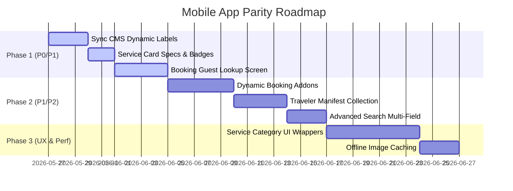
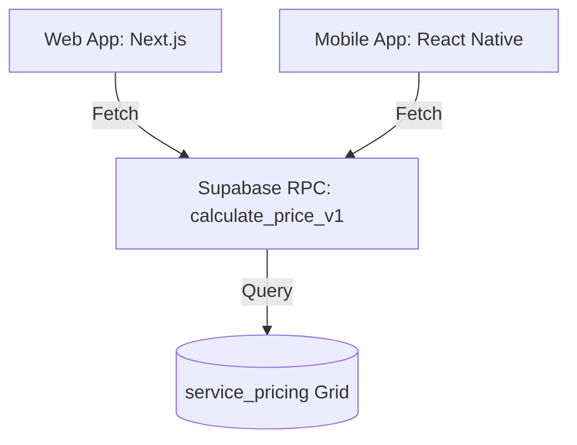

# Parity Audit & Ecosystem Analysis
**Ecosystem:** Travel Lounge 2026  
**Audited Platforms:** Mobile App (`apps/mobile-app`) vs. Web Application (`apps/web-app` & `apps/admin-app`)  
**Status:** Audit Complete  
**Date:** May 26, 2026  

---

## 1. Executive Summary

This audit establishes a complete technical and user-experience comparison between the **Travel Lounge 2026** Mobile platform and the authoritative Web ecosystem. The objective is to identify functional gaps, data inconsistencies, and architectural risks, providing a clear roadmap to bridge the platforms into a unified "Boutique Elite" standard.

### 1.1 Current Parity Estimate: **72%**
While the Mobile app is structurally solid, it functions as a "lite" gateway compared to the high-density conversion engine of the Web application.

```
┌─────────────────────────────────────────────────────────────┐
│ ■■■■■■■■■■■■■■■■■■■■■■■■■■■■■■■■■■■■■■■■     72%            │
└─────────────────────────────────────────────────────────────┘
  Core UI & Layout: 85%  |  Pricing Engine: 90%  |  Checkout: 70%  |  Search: 60%  |  CMS/Admin: 25%
```

### 1.2 Major Missing Systems
1. **Dynamic CMS Page Engine**: The Web app dynamically renders over 20 custom page layouts using slugs, whereas the Mobile app only consumes the `mobile-home` slug settings.
2. **Booking Traveler Collections**: Web captures full passport, age, and name lists for all travelers (`travelers: z.array(travelerSchema)`). Mobile only records the primary booker's contact details, losing critical traveler manifest data.
3. **Guest Booking Lookup**: Both platforms decommissioned Supabase Authentication to prioritize guest conversion. However, this leaves the Mobile "Bookings" tab entirely empty. Mobile lacks a guest-first lookup mechanism (e.g., searching by email/phone or booking reference).
4. **Universal Multi-Field Search**: Web search crawls across name, location, region, category, and descriptions. Mobile search is restricted to basic name and location `ilike` queries, ignoring description keywords and flexible region matching.

---

## 2. Feature Parity Matrix

| Web Feature / System | Mobile Status | Parity | Priority | Dependencies | Recommended Implementation |
| :--- | :--- | :--- | :--- | :--- | :--- |
| **Bespoke Hero Carousel** | Renders dynamic slides from `hero_slides` table. | **Complete** | - | `useHomeData.ts` | Sync dynamic banner overlays and transition speeds. |
| **Interactive Destination Map** | Renders custom SVG paths for Mauritius region filters. | **Complete** | - | `react-native-svg` | Already implemented via `InteractiveMap.tsx`. |
| **Aviation Booking Module** | Webpage iframe pointing to GOL IBE search gateway. | **Complete** | - | `react-native-webview` | Already optimized with link target overrides (`_self`) to prevent tab escaping. |
| **Service Cards Specs** | Simplified layout. | **Partial** | **P1** | `ServiceCard.tsx` | Add activity type badges (Sea/Land/Air), quick amenities, and duration clock. |
| **Booking Addons Checkout** | Hardcoded mock addons (Airport transfers, SIM card, Spa vouchers). | **Partial** | **P1** | `BookingModal.tsx` | Migrate mockup list to dynamic Supabase queries; support addon occupancy pricing. |
| **Booking Traveler Lists** | None. Only primary booker details are collected. | **Missing** | **P0** | `BookingModal.tsx` | Port the web's dynamic traveler array schema to React Native forms. |
| **Dynamic Supplements** | Calculations are performed on the fly in `useServicePricing.ts`. | **Complete** | - | `useServicePricing.ts` | Ensure fallback labels are synchronized with database updates. |
| **Universal Multi-Field Search** | Simple name/location matching. | **Partial** | **P2** | `useSearchServices.ts` | Expand search queries to include category and description fields. |
| **AI Concierge Assistant** | Floating widget that redirects queries directly to WhatsApp Web. | **Complete** | - | `AIConcierge.tsx` | Add support for local device text-to-speech if native-app capabilities are desired. |
| **Wishlist Storage** | Stores saves in local client state. | **Complete** | - | `WishlistContext.tsx` | Web uses `localStorage`; Mobile uses `AsyncStorage`. |
| **Guest Bookings History** | Blocked. Tab remains empty due to decommissioned auth. | **Missing** | **P0** | `bookings.tsx` | Replace auth-based fetches with a reference/email guest lookup form. |
| **Dynamic CMS & Wrappers** | Generic details layout for all service categories. | **Partial** | **P2** | `[id].tsx` | Port specialized layout wrappers (Hotels, Tours, Day Packages) from Web. |
| **Page-Level SEO Metadata** | Renders detailed JSON-LD metadata for all listings. | **Missing** | **P3** | `[id].tsx` | Integrate sharing utilities to append OpenGraph metatags on link copy. |
| **Admin Control Portal** | Web-only management dashboard (Pricing grids, CRUD). | **Missing** | **P3** | `admin-app` | Keep as web-only utility. No mobile port required. |

---

## 3. Gap Analysis Report

### 3.1 Critical Functional Gaps
* **Traveler Manifest Deficit**: The mobile app's booking modal collects only the lead booker's name, email, and phone. This prevents field staff and hotels from receiving traveler manifests (names, ages, passport details) for group bookings.
* **Static Upsell Addons**: Booking extras in `BookingModal.tsx` (Airport Transfers, SIM Cards) are hardcoded. Pricing calculations for these addons are flat-rate, ignoring occupancy multipliers (e.g., charge per person for transfers).
* **Search Matching Limits**: If a user searches for a regional keyword (like "East Coast" or "Tamarin") in the search query on mobile, it fails to match services unless that specific phrase is part of the service name.

### 3.2 Operational & Security Concerns
* **Broken Bookings Flow**: Due to the removal of authentication, the `My Bookings` screen (`(tabs)/bookings.tsx`) can never load records because `session?.user` is permanently null. This represents an operational blocker for guests who want to track their pending quotes.
* **Branding and Copy Inconsistencies**: The mobile `BookingModal.tsx` hardcodes key interface text ("Submit Request", "Travel Period & Occupancy") instead of fetching these from the database's `site_settings.ui_labels` configuration like the web app does.

### 3.3 Architectural Risks & Technical Debt
* **Calculation Redundancy**: The core pricing logic has been duplicated between `web-app/lib/pricingEngine.ts` and `mobile-app/src/hooks/useServicePricing.ts`. Any updates to the database schema or pricing rules (such as adding new age tiers or changing tax structures) require manual synchronization in two separate code repositories.
* **Direct URL Dispatch**: Mobile notifications hit the production Web URL (`https://www.travellounge.mu/api/notify/booking`) via a hardcoded fetch. If the web server API schema changes, mobile email dispatch will break silently.

---

## 4. Mobile Roadmap



### Phase 1: Native Branding & Core Parity (Short Term)
1. **Sync Dynamic Labels**: Migrate hardcoded UI headers in `BookingModal.tsx` to pull directly from `SettingsContext.tsx` (`ui_labels`).
2. **ServiceCard Refinements**: Implement Star Ratings, quick amenities (WiFi, Pool, Beach, Spa) badges, and activity badges (Sea/Land/Air) on the mobile listing cards.
3. **Guest Bookings Lookup**: Create a secure booking lookup screen in `bookings.tsx` where users can enter their email and Booking Reference (`TL-XXXXXX`) to pull status directly from Supabase, bypassing the empty tab blocker.

### Phase 2: Functional Parity (Mid Term)
1. **Traveler Manifest Arrays**: Add a dynamic traveler details step in `BookingModal.tsx` based on the number of adults/children selected, matching the web form array structure.
2. **Database-Driven Addons**: Fetch active addons from a new database lookup or dynamic settings config, ensuring supplement pricing updates automatically.
3. **Ecosystem Search Port**: Update `useSearchServices.ts` to crawl across name, region, location, and description fields using a PostgreSQL text search or clean `OR` filters.

### Phase 3: Premium UX & Performance (Long Term)
1. **Bespoke Category Layouts**: Implement specialized layout wrappers in `services/[id].tsx` so that Hotels show room grids, Day Packages show meal options, and Tours show step-by-step itineraries.
2. **Offline Image Cache**: Optimize image rendering using disk-based caching policies in `expo-image` to improve speed for return users.

---

## 5. Technical Recommendations

### 5.1 Shared Pricing Logic Opportunities
To eliminate code duplication, the pricing calculation logic should be consolidated:
* **Recommendation**: Expose a PostgreSQL RPC function `calculate_price_v1` on Supabase. Both the Web App and Mobile App can execute this RPC to fetch pricing details, ensuring that formulas are managed in a single, authoritative location.



### 5.2 API Standardization
* **Unified Notification Gateway**: Instead of the mobile app calling the web app's `/api/notify/booking` route directly, introduce a general Supabase Edge Function `notify-booking` that handles email dispatch. This decouples the mobile client from the web app's deployment cycles.

### 5.3 Offline Caching & Synchronization
* **Settings Pre-caching**: Load `site_settings` and `content_blocks` in the background and cache them locally using `AsyncStorage`. If a user opens the mobile app offline, fall back to cached settings immediately instead of blocking the app load with a spinner.
